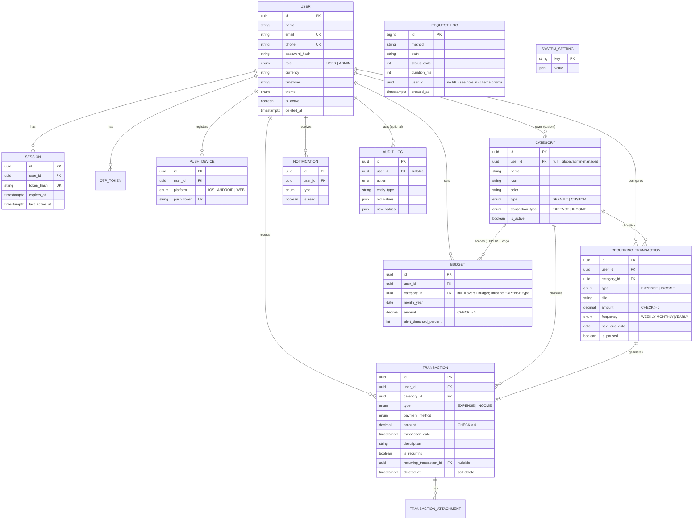

# MoneyKanakku — Database Layer

PostgreSQL 17 schema + Prisma ORM for the Monthly Expense Tracker. This folder is
fully self-contained: its own isolated Postgres data cluster, its own port, its
own Node project — nothing here touches any other database or service already
running on this machine.

## v2 changelog (2026-09-11)

The UI grew Income tracking alongside Expense, plus two admin ops pages
(Audit Logs, Live Ops). The schema was enhanced to match, not just extended:

- **`Expense` → `Transaction`**, `RecurringExpense` → `RecurringTransaction`,
  `ExpenseAttachment` → `TransactionAttachment`. Both models gained a
  `type: TransactionType` (`EXPENSE | INCOME`) field. `Category` gained the
  same field to scope it to the Expense or Income tab (e.g. "Food" vs.
  "Salary" are never interchangeable) — this is a real rename, not a
  bolt-on: the table is now `transactions`, not `expenses` holding income
  rows under a misleading name.
- **New `PushDevice` model** — the "Push notifications" toggle on
  settings.html had no way to actually deliver anything without a
  registered device/token to send to.
- **New `RequestLog` model** — backs `admin-live-ops.html`'s Hottest/Slowest
  endpoint tables and API req/min signal. See `queries/live_ops.sql` for
  where every metric on that page actually comes from (this table, the
  existing `sessions` table, Postgres's own `pg_stat_*` views, or pure
  in-process state that never touches the database at all).
- **Every instant-valued `DateTime` is now explicitly `@db.Timestamptz`.**
  This was a real bug fix, not a style preference — see "The timestamptz
  incident" below.
- Budgets stayed expense-only (explicit product decision, unchanged from
  v1) — `Budget.categoryId` should only ever reference a
  `transactionType=EXPENSE` category, enforced at the application layer
  since Postgres can't `CHECK` across tables without a trigger.

### The timestamptz incident

While seeding data for the new `RequestLog` table, `WHERE created_at > now()
- interval '1 hour'` was returning **zero rows** despite rows having just
been inserted. Root cause, confirmed by direct `psql` inspection (not
guessed): Prisma's default `DateTime` maps to `timestamp without time zone`,
and this cluster's session `timezone` defaulted to `Asia/Calcutta` (India,
+5:30) — the classic setup for a `timestamp without time zone` column to
silently store the wrong absolute instant depending on exactly how a client
library serializes a `Date` for the wire. A row inserted "now" was measured
as 5 hours 30 minutes old — precisely the IST offset.

Fixed at two levels, not just one:

1. **Every `DateTime` in the schema representing an absolute instant is now
   `@db.Timestamptz`** — see the header comment in `schema.prisma` for the
   full list and the reasoning for which fields stayed plain `@db.Date`
   instead (recurrence schedule fields like `nextDueDate` have no
   time-of-day or timezone meaning at all).
2. **The cluster's own default `timezone` was changed to `UTC`**
   (`pgdata/postgresql.conf`) — the standard, boring, correct answer for
   any production Postgres server is to run it in UTC and convert to a
   user's local time only at the presentation layer (the app already has
   `User.timezone` for exactly that). This removes the ambiguity at the
   source instead of trusting every client library to always get instant
   serialization right.

Verified fixed by direct `psql` re-test after both changes (see git history
of this file / re-run the queries in `queries/live_ops.sql` — `now() -
max(created_at)` on freshly-seeded rows reads in seconds, not hours).

A second, unrelated bug was fixed in the same pass: `scripts/start-db.ps1`
contained an em-dash (`—`) character that PowerShell 5.1 misreads in a
non-BOM file, breaking the script's parser entirely. Fixed by keeping all
`.ps1` scripts pure ASCII (plain hyphens instead of em-dashes) — a small
but real lesson about Windows PowerShell 5.1 specifically, not a Postgres
issue.

## Why an isolated instance

Two other PostgreSQL services were already running system-wide when this was
built (`postgresql-x64-13` on port 5432 with live connections from another
project, `postgresql-x64-17` on port 5433). Rather than risk either of those,
this project initialized its **own** Postgres data directory at `db/pgdata`
and configured it to listen on **port 5544** only. It's a completely separate
cluster — starting, stopping, or resetting it can never affect anything else
on the machine.

```
db/
├── pgdata/              isolated Postgres 17 data directory (gitignored)
├── logs/                 postgres.log (gitignored)
├── scripts/
│   ├── start-db.ps1      start the MoneyKanakku Postgres instance (port 5544)
│   ├── stop-db.ps1       stop it (only this instance)
│   └── status-db.ps1     check if it's running
├── prisma/
│   ├── schema.prisma     the schema — source of truth
│   ├── client.ts         shared PrismaClient factory (driver-adapter setup)
│   ├── seed.ts           idempotent demo-data seed, matches the UI mockups
│   └── migrations/       generated + two hand-written migrations
├── queries/               hand-tuned example SQL for the heaviest screens
│   ├── dashboard.sql
│   ├── budget_status.sql
│   ├── recurring_scheduler.sql
│   ├── reports.sql
│   ├── live_ops.sql       where every admin-live-ops.html metric comes from
│   └── scaling_notes.sql  materialized view + request_logs partitioning path
├── .env.example
└── package.json
```

## Getting started

```powershell
cd db
npm install

# 1. Start the isolated Postgres instance (idempotent — safe to re-run)
npm run db:start

# 2. Point Prisma at it
copy .env.example .env
# edit .env and set the real password (see "Credentials" below)

# 3. Apply the schema + hand-written constraints
npm run db:deploy

# 4. Load demo data that matches the built UI screens
npm run db:seed

# 5. Browse the data visually
npm run db:studio
```

To stop the instance when you're done: `npm run db:stop`. It will not affect
the other PostgreSQL services on this machine.

### Credentials

| | |
|---|---|
| Host | `localhost` |
| Port | `5544` (**not** 5432/5433) |
| Superuser | `expensio_admin` |
| Database | `expensio_db` |
| Server timezone | `UTC` (see "The timestamptz incident" above) |
| Password | set once via `initdb --pwfile` when the cluster was created; put it in your local `.env` — it is never committed |

Seeded application logins (see `prisma/seed.ts`):

| Role | Email | Password |
|---|---|---|
| Admin | `admin@expensio.app` | `Admin@12345` |
| User (demo — "Priya Sharma" from the UI mockups) | `priya@example.com` | `Demo@12345` |

## Entity-relationship diagram



## Design decisions, compared against world-class expense apps

The schema was benchmarked in spirit against Mint, YNAB, Splitwise, Walnut,
Money Manager and Spendee — here's what was deliberately borrowed, and what
was deliberately left out because the FRS/UI don't call for it:

- **Soft-deleted transactions (`deleted_at`), never a hard `DELETE`.** Every
  one of those apps preserves a financial audit trail; FRS §9 makes this
  explicit ("Deleted transactions must not compromise historical audit
  integrity"). All report/dashboard queries filter `WHERE deleted_at IS NULL`.
- **Money is `Decimal(12,2)`, never `Float`/`Double`.** Floating-point
  currency math is the single most common real-world bug in this category of
  app — every serious fintech schema uses fixed-point decimal.
- **One `Transaction` table with a `type` column, not separate Expense and
  Income tables.** Every mainstream expense tracker (Money Manager, Walnut,
  Spendee) models it this way — a "transaction" is one concept with a
  direction, and it lets a single query answer "everything that happened
  this month" (dashboard's Income vs Expense card, expenses.html's unified
  list) without a `UNION`. The alternative (two parallel tables) would have
  doubled every index, query and migration for no real benefit.
- **Global vs. custom categories** (`Category.userId` nullable), now further
  scoped by `transactionType`, mirrors how YNAB/Walnut ship a curated
  default category set per side (expense categories vs. income sources)
  that admins/the platform maintain, while still letting each user add
  their own — matches `admin-categories.html`'s Expense/Income tabs exactly.
- **`PaymentMethod` is a fixed enum, not its own table.** Full multi-account
  ledgers (bank/wallet balances, transfers between accounts) are what
  Splitwise/YNAB do at the next tier up, but the FRS only ever asks for
  "Payment Method" as a field on a transaction — modeling a whole Accounts
  subsystem here would be speculative scope the UI never exposes.
- **`AuditLog` as a generic, polymorphic table** (`entityType` + `entityId` +
  JSON before/after) rather than a bespoke history table per model. This is
  the standard compliance-log pattern in fintech schemas and covers admin
  actions (`admin-users.html` suspend/reactivate) the same way it covers a
  user editing a transaction — and now backs `admin-audit-logs.html` directly.
- **`RequestLog` has no foreign key on `userId`.** A hard FK on the
  highest-volume, append-only table in the schema would slow every insert
  and block deleting a user while their request history still exists —
  both real production concerns, not theoretical. Deliberately the one
  table in this schema that trades referential integrity for write
  throughput, and it's called out explicitly in `schema.prisma` so it
  reads as a decision, not an oversight.
- **`SystemSetting` as a key/value table**, not one column per setting. The
  admin System Config screen (`admin-categories.html#system`) is exactly the
  kind of screen that grows new toggles over time; a KV table means adding
  one is a seed-data change, not a migration.
- **Session-based auth**, per FRS §7 ("Authentication: Session-based
  authentication") — deliberately *not* JWT. Only a hash of the session
  token is ever persisted (`Session.tokenHash`), the same way a password is
  only ever stored hashed. The same table doubles as the source of truth
  for Live Ops' "Online Users" and "Active Sessions" — no separate
  presence-tracking system needed.
- **What was left out on purpose:** multi-currency *conversion* (FX rates,
  historical rate snapshots), shared/group expenses & settlements
  (Splitwise's core feature), bank-feed sync/transaction import, and
  income *budgets*/goals (budgets stayed expense-only, an explicit product
  call). None of the 30 built screens expose any of these — adding the
  tables now would be unused schema.

## Indexing strategy

| Table | Index | Serves |
|---|---|---|
| `transactions` | `(user_id, type, transaction_date DESC)` partial `WHERE deleted_at IS NULL` | Dashboard/expenses.html's Expense/Income toggle + "recent transactions" — the hottest query in the app |
| `transactions` | `(user_id, category_id)` | Category breakdown, category detail table |
| `transactions` | `(user_id, payment_method)` | Reports → Payment Method tab |
| `transactions` | GIN trigram on `description` (`pg_trgm`) | search.html's substring/typo-tolerant search |
| `recurring_transactions` | `(next_due_date, is_paused)` | Daily scheduler job — pure index scan, no table scan |
| `budgets` | `(user_id, month_year)` + partial unique `(user_id, month_year) WHERE category_id IS NULL` | Budget page; also *enforces* "one overall budget per month" |
| `categories` | `(user_id, transaction_type, is_active)` + partial unique `(name, transaction_type) WHERE user_id IS NULL` | Category list; also *enforces* unique global category names per type |
| `notifications` | `(user_id, is_read, created_at DESC)` | Notification bell + unread filter |
| `sessions` | unique `(token_hash)`, `(expires_at)`, `(last_active_at)` | Session lookup on every request; cleanup job; Live Ops presence queries |
| `audit_logs` | `(entity_type, entity_id)`, `(user_id, created_at DESC)`, `(action, created_at DESC)` | "Show history for this record" / admin activity feed / filter-by-action |
| `request_logs` | `(path, created_at)`, `(created_at)`, `(status_code)` | Hottest/slowest endpoint aggregation; retention pruning; error-rate queries |

Three constraints Prisma's schema language can't express yet were added by
hand in `prisma/migrations/*_manual_constraints/migration.sql`: `CHECK`
constraints (amount > 0, valid date range, alert-threshold range) and the two
type-aware partial `UNIQUE` indexes above. A fourth migration
(`*_search_indexes`) adds the `pg_trgm` extension + trigram index. All of it
was verified to actually reject bad data / return real rows with live
`INSERT`/`SELECT` tests against the running instance — not just assumed
correct from reading the SQL.

## Business rules enforced at the database level (FRS §9)

| Rule | Enforcement |
|---|---|
| "Expense amount must be greater than zero" | `CHECK (amount > 0)` on `transactions`, `recurring_transactions`, `budgets` — applies to income rows too, since `amount` is always a positive magnitude and `type` carries the direction |
| "Every expense must have a valid category" | `category_id` is `NOT NULL` with `onDelete: Restrict` — a category in use can't be deleted out from under a transaction |
| "Expense date must be valid" | `CHECK (transaction_date <= now() + interval '1 day')` — blocks year-typo far-future dates while allowing same-day entry across timezones |
| "Deleted transactions must not compromise historical audit integrity" | Soft delete (`deleted_at`) everywhere financial history matters, plus the generic `AuditLog` (now surfaced directly in `admin-audit-logs.html`) |
| "Budget calculations shall use confirmed expenses only" | Every budget/report query filters `deleted_at IS NULL AND type = 'EXPENSE'` |
| Budgets are expense-only (product decision, not FRS) | Application-layer invariant on `Budget.categoryId` — documented in `schema.prisma`'s header rather than silently assumed, since Postgres can't `CHECK` it across tables without a trigger |

## A note on Prisma 7

This project uses Prisma ORM **7**, which changed two things worth knowing
about if you've used Prisma 5/6 before:

1. Config lives in `prisma7.config.ts`, not a `datasource` URL alone.
2. `PrismaClient` no longer connects implicitly — a driver adapter is
   required. `prisma/client.ts` is the one place that's wired up
   (`@prisma/adapter-pg`); import `{ prisma }` from there everywhere else
   instead of instantiating `new PrismaClient()` directly.

## Next step

This completes the **database phase** (v2). The API layer (Express/Node per
the FRS's recommended stack) is next, and will import `prisma/client.ts` as
its data access layer — the schema, indexes, seed data, and example queries
here (including `queries/live_ops.sql`, which doubles as a spec for the
metrics middleware the API will need) are all it needs to build against.
